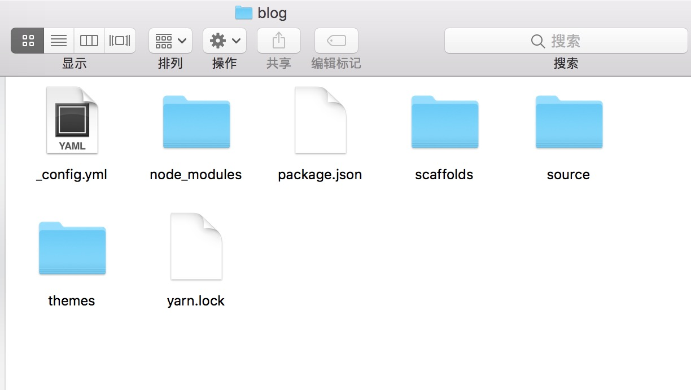
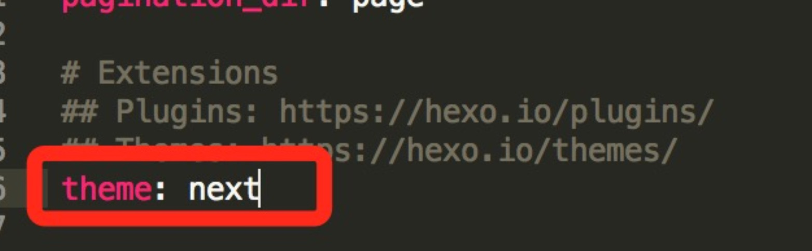
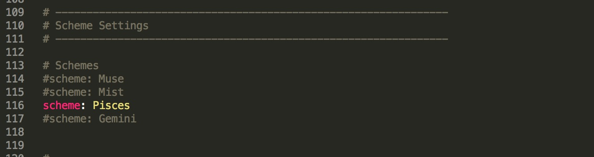

## 搭建环境 ##
1. 安装安装环境:`homebrew`--->`nodejs`--->`hexo`,确保我们电脑安装了 ruby ,因为 homebrew 安装时依赖ruby的,使用`ruby --version`查看ruby版本    

 *  安装 `homebrew`      
`ruby -e "$(curl -fsSL https://raw.githubusercontent.com/Homebrew/install/master/install)"` 
 *  安装 nodejs    
`brew install node`
 * 安装git(Xcode自带Git 可以忽略)
 *  安装 hexo      
`sudo npm install -g hexo` 如果安装失败 就使用 `sudo  npm install -g hexo-cli`

2. 创建文件夹，下面创建一个blog文件夹并在目录下初始化 hexo    

``` objc
mkdir blog
cd blog
hexo i // init 的缩写
```
此时blog文件下出现了很多文件和文件夹，如下图所示:   

<!--more--> 

    
然后我们可以试试创建一套静态网页

``` objc
 hexo g /** generate 的缩写 生成一套静态网页 **/
 hexo s /** server 的缩写 在服务器上运行 **/

```

在浏览器上运行 http://localhost:4000 就能看到我们的 Hello World 了

## 撰写博客 ##
在这个目录下，输入命令:    
`hexo n post "我的第一篇博客" /* new 的缩写 创建新的 .md 文件 */`   

随后终端会出现如下消息:
`INFO  Created: ~/blog/source/_posts/我的第一篇博客.md`    

这证明创建文章成功，“我的第一篇博客”这个md文件会创建在 `source/_posts/` 的文件下。该md文件在自动生成时会带有一些属性：    

title:     定义了博文的标题

date:   定义了创作博文的时间

tags:   定义了博文的标签

除了这个三个属性以外我们还可以扩展一些属性：

update:  定义了最后修改的时间

comments：定义能否评论此博文(默认为true)

categories: 定义了博文的种类

## 配置博客 --  _config.yml说明 ##
 * Hexo 的每一个功能都由 `_config.yml`文件配置，文件就在blog根目录下 具体说明看下面的注解：

```objc

# Hexo Configuration
## Docs: https://hexo.io/docs/configuration.html
## Source: https://github.com/hexojs/hexo/
 
# Site                 ##修改以适应搜索引擎的收录
title: Hexo            ##定义网站的标题
subtitle:              ##定义网站的副标题
description:           ##定义网站的描述
author: jason jwl      ##定义网站的负责人
language:              ##定义网站的语言,默认zh-Hans
timezone:              ##定义网站的时区
 
# URL
## If your site is put in a subdirectory, set url as 'http://yoursite.com/child' and root as '/child/'
url: http://yoursite.com   ##定义网站访问的域名
root: /      ##定义所在Web文件夹在哪个目录
permalink: :year/:month/:day/:title/  ##定义时间格式
permalink_defaults:
 
# Directory
source_dir: source   ##定义从哪个文件夹获取博客资料
public_dir: public   ##定义生成静态网站到哪个文件夹
 
archive_dir: archives
category_dir: categories
code_dir: downloads/code
i18n_dir: :lang
skip_render:
 
# Writing
new_post_name: :title.md # File name of new posts
default_layout: post
titlecase: false # Transform title into titlecase
external_link: true # Open external links in new tab
filename_case: 0
render_drafts: false
post_asset_folder: false
relative_link: false
future: true
highlight:
  enable: true
  line_number: true
  auto_detect: false
  tab_replace:
 
# Category & Tag
default_category: uncategorized
category_map:
tag_map:
 
# Date / Time format
## Hexo uses Moment.js to parse and display date
## You can customize the date format as defined in
## http://momentjs.com/docs/#/displaying/format/
date_format: YYYY-MM-DD
time_format: HH:mm:ss
 
# Pagination
## Set per_page to 0 to disable pagination
per_page: 10  ##定义每一页多少条博客
pagination_dir: page
 
# Extensions
## Plugins: https://hexo.io/plugins/
## Themes: https://hexo.io/themes/
theme: landscape  ##定义使用的主题
 
# Deployment
## Docs: https://hexo.io/docs/deployment.html
deploy:
  type:
 

```

注意：

 修改这些属性时，请注意格式，属性和值要空一个格，比如theme: landscape。

* 选择主题 比如 next    
 1. 在当前目录输入：    
`git clone https://github.com/iissnan/hexo-theme-next themes/next`       

 2. 打开 配置文件 在根目录下 `_config.yml` 找到 `theme` 字段 并将其值更改为 `next`        
     
把 `landscape` 改为 `next`     

 3. 在终端输入     
  
 		```objc 
 		hexo clean  //清除缓存
 		hexo g  //重新生成代码
 		hexo s  //部署到本地
 		// 然后打开浏览器访问 localhost:4000 查看效果
 		```
 		
4. 配置`next`，next 主题有三种选择，这个只是最简洁的一种，我们选择最好看的那个。这个需要在`站点根目录/themes/next/_congig.yml`文件中修改  
  * Muse - 默认 Scheme，这是 NexT 最初的版本，黑白主调，大量留白
  * Mist - Muse 的紧凑版本，整洁有序的单栏外观
  * Pisces - 双栏 Scheme，小家碧玉似的清新
  如下图,将不使用的主题注释掉即可    
  
   
  然后我们重新 clean, generator 刷新网页即可    
  [更多next设置](http://theme-next.iissnan.com/getting-started.html)
  

### 本地同步github ###
1. [创建github.io博客](./创建-github-io)    
2. 
    

2. 安装插件 
`npm install hexo-deployer-git --save`
 
3. 可以通过修改 `_config.yml` 让 hexo 帮助我们同步到github ,配置如下

```
deploy:
  type: git
  repo: https://github.com/xxx/xxx.github.io.git
  branch: master
  ## xxx为个人github的name
  
```

配置完后，发布，运行下面的终端命令 
`hexo d /* deploy 的缩写 发布命令*/`

4. 以后当你新增文章或者插件时，可以通过下面三个命令进行同步操作
 
```
hexo c
hexo g
heox d
```

## 更多 ##

```

https://hexo.io/themes/ 更多hexo主题
https://www.zhihu.com/question/24422335 知乎上的hexo主题
https://blog.csdn.net/Hoshea_chx/article/details/78826689

```


