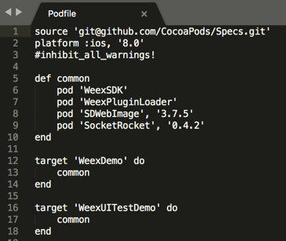
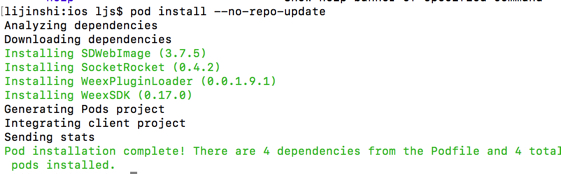
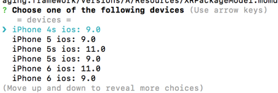
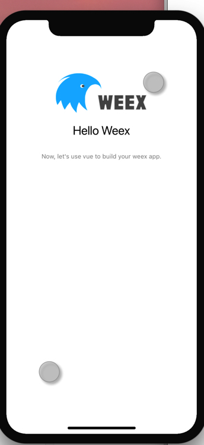

*  [Weex](http://weex.apache.org/cn/guide/) 是2016年6月由阿里巴巴推出的一个动态化的高扩展跨平台解决方案，可以类比一下React Native,能够完美的兼容性能与动态性，让移动开发者通过简捷前端语法写出原生级别的性能体验,目前支持iOS、安卓及Web等多端开发部署。weex主要解决的是频繁发版和多端研发两大痛点，同时又解决了前端语言性能差和显示效果受限的问题，极大地解放开发者的同时又保证了用户体验。
*  同年12月捐赠给Apache。
*  Weex 号称`一次编写 处处运行` 积极拥抱 Web 标准，专注于 Native 渲染层优化的细致工作，也清晰地展示了这个项目的自身定位和发展方向

<!--more-->
--
* 搭载 Node 基础环境        
* 可以直接在浏览器中调试JS代码,需要一些[ES6基础](http://es6.ruanyifeng.com)
* 基于[Vue.js](https://cn.vuejs.org/v2/guide/)
* 我使用的`Atom` 插件          
`language-vue-component`        
`language-weex`


## 安装 ##

#### 安装Node.js  ####

##### [Homebrew](https://brew.sh)  #####
`/usr/bin/ruby -e "$(curl -fsSL https://raw.githubusercontent.com/Homebrew/install/master/install)"`    


##### 使用Homebrew来安装[`Node.js`](https://nodejs.org/en/) #####

`brew install node`    

安装完 node 后建议设置 npm 镜像以加速后面的过程（或使用科学上网工具）。注意：不要使用cnpm！cnpm安装的模块路径比较奇怪，packager不能正常识别！

```
npm config set registry https://registry.npm.taobao.org --global
npm config set disturl https://npm.taobao.org/dist --global
```

(这里需要是用 npm 还是 yarn 可以去 react native 官网 看看 )

#### 然后全局安装 `weex-toolkit` ####

`npm install weex-toolkit -g`

cd 到文件夹 创建项目
`weex create awesome-app`


```objc
? May weex-toolkit anonymously report usage statistics to improve the tool over
time? Yes
? Which npm registry you perfer to use? taobao
? Project name newproject
? Project description new
? Author duanyutian
? Select weex web render lts
? Babel compiler (https://babeljs.io/docs/plugins/#stage-x-experimental-presets)
 stage-0
? Use vue-router to manage your view router? (not recommended) No
? Use ESLint to lint your code? Yes
? Pick an ESLint preset Standard
? Set up unit tests No
? Should we run `npm install` for you after the project has been created? (recom
mended) yarn
```


> Ps:已经安装了 yarn 使用 yarn 否则使用 npm ,同理下面的命令行也是(因为之前看了rect native 的安装，所以建议使用yarn)

### 开发 ###

```
cd awesome-app
yarn install
yarn start
```

### iOS ###

weex platform add ios    

<< `if` 网速够好 可以直接 weex run ios >>    
<< `else` 到platforms/ios目录下为ios工程用cocoaPods安装第三方依赖，这里ios工程需要安装的依赖可以打开ios目录下的Podfile文件查看,如下（修改版本为0.17.0）
    
 

 。。
好了，接下来用pod命令对这些依赖进行安装，cd 到 ios 目录，pod install就可以了，前提是要先安装好cocoaPods，ios开发对它都比较熟悉，这个网上有很多教程。还有如果pod库很久没有更新的话很可能会安装失败，因为找不到上图中新版本的weex相关的库，建义pod setup，pod update更新一下库。这个最好翻-墙操作，否则会等很久。如果之前更新过pod，那使用 pod install --no-repo-update 安装会更快。安装好后如下：   （使用pod update --no-repo-update --verbose 来代替 pod update）>>    

      

5. 再回到weex根目录，启动ios 模拟器

　　weex run ios

　　这一行命令下去，会先启动weex的webpack服务，即它在浏览器中打开，同时又弹出另一个命令行，显示蓝色字，如下。     

```
    => Will start iOS app
    => pod update

```


　　这个时候就静静等着就好，然后会出来选择模拟器界面，如下       
　　    
　　        


6.我选择了一个iphonex模拟器，启动后如下图，和pc上浏览器上显示内容一样     

    


## 对比 ##

优点：
1. 跨平台 一套代码多端运行
2. 远程部署
3. 加载网页更加流畅 功能更加强大
4. 相比其他跨平台，门槛相对要低

缺点： 

> 跨平台通病:     
    
1. 用户体验不如原生的完美     
2. 开源库不如原生的丰富，完成复杂的功能比较困难
3. 缺少安全性 类型难以扩展、重构易出错
4. 每一次原生或者 weex 内嵌的第三方的变动都需要 weex 先更新，适配，然后才到原生支持。

> Weex 缺点:    
 
1. 不好debug，没有客户端调试工具，而web页调试和实际显示效果可能会有偏差    
2. css 不是是所有的都支持 比如 `border-width:50%` 被解读成50px     
3. 本地资源文件读取各端都不一样，需要各端分别配置      
4. 开源社区不活跃，项目由apache开发，文档却是阿里编写，文档简单且更新慢， demo bug 多     
5. weex有web组件支持显示web端。但是没有提供任何交互API，也没办法拦截     
6. 在Github上主要贡献人员以阿里为主，额外贡献人很少， 目前已交由apache维护，但是官方文档还是由阿里编写，文档更新很慢，demo bug 较多。而且目前社区规模较少

## <center>总结 ##

感觉weex的生态环境有点类似 `Windows Phone`, `Windows Phone`号称第三大手机系统，由微软推出，在出来的时候 我也买了华为 WP1，动态磁贴很不错，系统比较整洁，但是直到WP2 才支持内存卡存储。但是应用市场app很少，且功能简单，开发者也不活跃，微软也没有太多作为，到现在都没落了。

目前其实还不太适合全面开发，生态环境不够稳定，开源社区活跃度不够。

#### 结语 ####
　　自从Weex出生的那一天起，就无法摆脱和[React Native](https://reactnative.cn)相互比较的命运。React Native宣称“Learn once, write anywhere”，而Weex宣称“Write Once, Run Everywhere”。Weex从出生那天起，就被给予了一统三端的厚望。React Native可以支持iOS、Android，而Weex可以支持iOS、Android、HTML5。

　　在Native端，两者的最大的区别可能就是在对JSBundle是否分包。React Native官方只允许将React Native基础JS库和业务JS一起打成一个JS bundle，没有提供分包的功能，所以如果想节约流量就必须制作分包打包工具。而Weex默认打的JS bundle只包含业务JS代码，体积小很多，基础JS库包含在Weex SDK中，这一点Weex与Facebook的React Native和微软的Cordova相比，Weex更加轻量，体积小巧。在JS端，Weex又被人称为Vue Native，所以 React Native 和 Weex 的区别就在 React 和 Vue 两者上了。
　　
#### 使用过程 ####
*  单页面中，web通过前进 回退按钮切换界面，而在客户端 weex提供[navigator](http://weex.apache.org/cn/references/modules/navigator.html)组件实现类似的效果，并内置了动画效果。但这个组件对web端无效
*  多页面中，weex可以使用路由器`vue-router`进行界面跳转，iOS、Android、Web 三端适用 
*  遗憾的是这两个组件不能同时使用，也就是无法实现客户端上面的Tabbar+navigationbar 的布局，所以需要使用自定义一个组件来替换`vue-router`.
* 文档简单到只能让人写一个demo 很多东西一笔带过
* 每一次运行客户端都需要等待大量时间，还非常依赖网速，一旦网速不行 超时就无法运行成功。
* 我在编写的时候 很多都无法全部填充 `flex:1` 感觉有的时候没有效果，比如我在web上可以看到全部填充，list组件显示，但是在模拟器上效果不一样
* 本地资源文件读取这个是重点，各端路径不一致，而官网语焉不详

## 关于Weex与iOS开发者的思考 ##

1. 不同的开发模式

从去年开始，移动端的开发模式就有很多更新，包括ionic（就是后来的cordova），React Native，今年开源的Weex，原生+网页，当然最传统的还是原生开发方式。新技术是因为新需要，跨平台和混合的方式确实解决了部分的效率问题。由于公司需要我最近也研究了一下。感触颇深

> 在最开始，你会觉得未来如此美丽，我还需要写原生吗？我还需要多平台吗？不用了！前端搞定一切！但是当你真的了解了之后发现并不是这样的。你需要解决的事情太多了。

RN的复杂，就不说React本来就很复杂，JSX的语法我个人感觉有点说不出来的头痛，恕我技穷，我都找不到一个完美支持代码补全的合适的IDE。Redux把本来很简单的事情搞的相当复杂，Action Reducer…

ionic 的存在表示很尴尬，外壳包着web。。我浏览器，微信公众号就搞定了，还需要你的外壳吗？？

原生+网页。倒是很灵活，貌似也解决不了跨平台的效率问题。。不过对于大公司倒是一切都不是问题。

最后说道Weex ，

是我迄今为止看到的比较完美的解决方案。上手简单。与普通的前端开发衔接顺畅，但是毕竟开源不久，第三方组件和库都不是非常完整，而且据说阿里的开源项目一般都XXX(此处省略一万字)。对于原生开发者来说，有很多优势，语法简单，虽然砍掉了一些web的原生支持的方法，比如一些css样式，适配也仅仅是把width固定位750px，所有其他屏幕都是按比例缩放，选择器只支持类，而且没有子代选择。有些控件 比如a，p，这些标签也砍掉了，虽然对比完整的额web开发，少了灵活性，但是这无形中也给一些原生开发者带来了便利。上手更简单了，不用考虑那么多了。有利有弊。对于原生开发者倒是很值得一试，就当web入门了也行。

对了，weex是基于vue的，vue的易用性在web开发中可见一斑。

其实现在最担心的就是weex后期的维护，希望能把上面漏掉的一些web的东西都补起来。希望他能经得起时间的考验吧！

当然听说 [Flutter](https://flutter-io.cn)的体验和生态更好，可以去试试了

## 链接 ##

#### 学习链接 ####
[《Weex 踩坑攻略》](https://www.jianshu.com/p/497f1a9ff33f)

[《Weex 二》](https://www.cnblogs.com/saytome/p/7205132.html)

[《Weex 入门》](https://blog.csdn.net/qianqianyihao/article/details/76037543)

[《Weex 学院》](https://www.weexdaxue.com)

[《Weex GitHub》](https://github.com/alibaba/weex)

[《Weex Blog》](https://github.com/ShowJoy-com/showjoy-blog/labels/weex)

[《Weex 简书》](https://www.jianshu.com/c/f152a6d31479)

[网易严选](http://www.cocoachina.com/programmer/20171013/20790.html?utm_source=debugrun&utm_medium=referral)

[云栖社区](https://yq.aliyun.com/articles/57995)

[Weex 视频](http://www.chungold.com/course/3)

[关于Weex 的一些知识](https://segmentfault.com/a/1190000007560611)

[技术胖的博客](http://jspang.com/tag/weex)


####  相关框架 ####

[EROS](https://zhuanlan.zhihu.com/p/38905196)

[调试框架](https://blog.csdn.net/hopeyouknow/article/details/51800715)

[Weex入门教学 (iOS端读取js ,拦截点击)](https://www.jianshu.com/p/bccad91fc327)

[现有iOS集成weex](https://www.jianshu.com/p/f842811bd895)