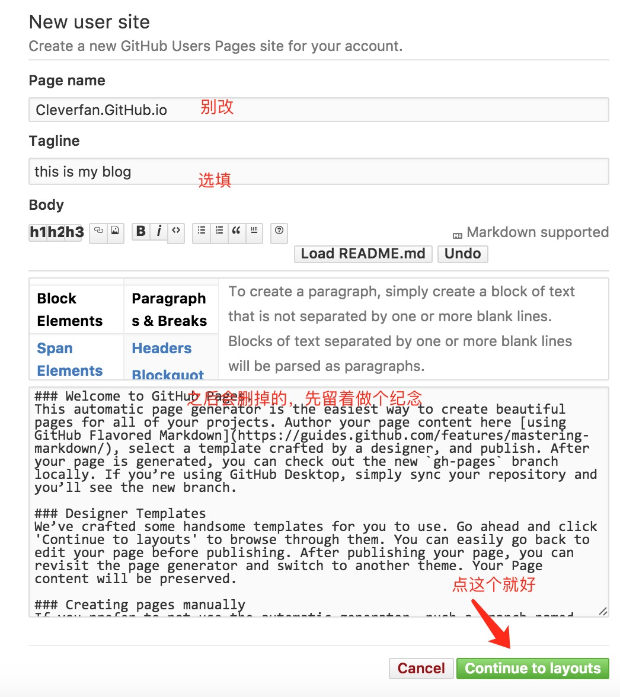

# 准备工作    
1. 注册[GitHUb](https://github.com/)账号    

2. 创建新的项目    
    
3. 按格式输入项目名称    
     
4. 点击设置 创建一个page   
  
    
    
     
5. 随意选择一个主题     

      
6. 查看效果，输入`用户名.github.io`
     
     

