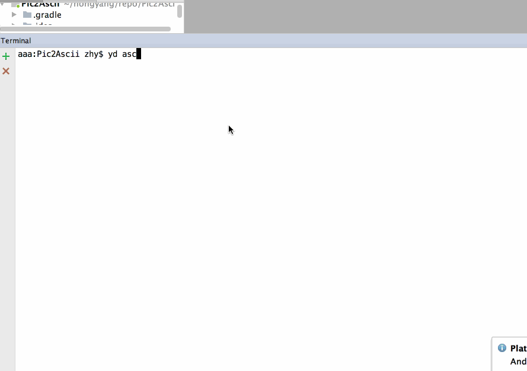
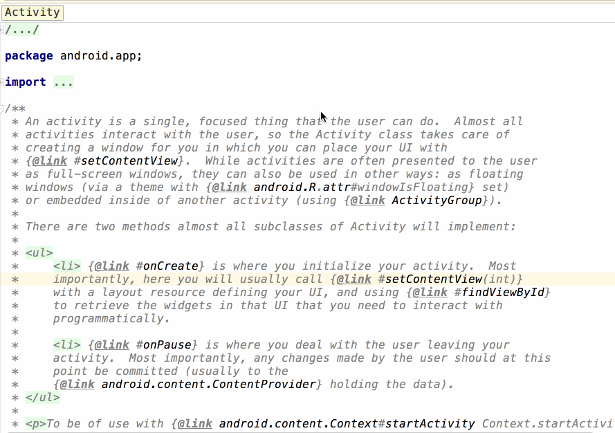
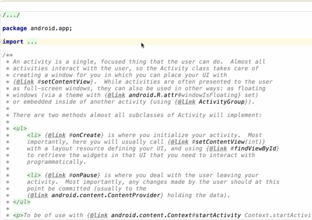

[文章来源](https://mp.weixin.qq.com/s/Bm6cwzA2yAxr5kpDwUz9YQ)

终于周五了，周末一定要好好休息一波，每逢周五的文章都会较为轻松。

大家在平时开发过程中，是不是经常要查一些单词的意思，或者某个中文词语、某段中文希望翻译成英文。

一般情况下，我们可以通过某个翻译app，比如有道；又或者打开浏览器打开web 在线翻译。

那么这两个操作我还是觉得有点重，我觉得这样翻译才有意思：

    

<!--more--> 

我们可以不跳出 Studio，直接翻译，或者在自己喜欢的 命令行工具中直接敲英文。

是不是更加轻量。

那么还有个场景，例如我正在看源码，看到一段英文注释或者单词想要翻译，当时我正在源码中操作，我并不希望copy 到命令行，再来看结果，你可以这样：

    


这样的操作就连贯很多了，而且支持多种语言，还能直接播放声音。

至于推荐它还有个更大的原因就是，目前有700多次提交，近期还在更新。

接下来就是详细介绍一哈了。

## 1. 翻译插件 ##

[https://github.com/YiiGuxing/TranslationPlugin](https://github.com/YiiGuxing/TranslationPlugin)

#### 安装 ####

网络良好的很开心了，搜索安装即可：

`Preferences(Settings)` > `Plugins` > `Browse repositories...` > 搜索并找到 `Translation` > `Install Plugin`

网络不太流畅的，可以下载zip 包: 

`下载最新发布的插件包` -> `Preferences(Settings)` > `Plugins` > `Install plugin from disk...`

这个文档写的很清楚，而且还有一些别的功能，比如，我并不是划词查询，我就想查某个单词的意思，也可以唤起翻译面板：

    

当然这样就是通过快捷键打开了，具体支持哪些快捷键，自己看文档吧。

## 2. 命令行翻译 ##

> 项目介绍：不喜欢安装有道词典的应用程序，因为太耗资源还一堆广告，但是用浏览器打开dict.youdao.com也挺麻烦的，不是吗？快来试试我的有道词典命令行工具吧！
 
 [https://github.com/kenshinji/yddict](https://github.com/kenshinji/yddict)
 
#### 安装 ####

```
npm install yddict -g
```
> 安装如果因为权限为问题失败，可以加上以管理员身份运行；如果安装完成后提示node.js 版本过低，记得升级。

#### 使用 ####

`yd <要查询的单词>`

默认情况下，查出来的单词是白色的文字，如果 AS 是默认主题，那么就会看不到。当然，颜色支持我们自己设置。

默认在 *`用户主目录下.config/configstore/yddict.json`*

```
.config/configstore/yddict.json 
{
    "color": "green",
    "spinner": true
}
```

我们可以自由修改这个字的颜色。

推荐完毕，祝大家周末愉快！

推荐阅读：

[启动优化提升60%](https://mp.weixin.qq.com/s?__biz=MzAxMTI4MTkwNQ==&mid=2650826203&idx=1&sn=4c83f119ae3a7e818a65357cb78e5df5&chksm=80b7b145b7c038538ef46e7b16d41b6dc5d622b6a3c72ce67ce9735c49709f011d334e1366f9&scene=21#wechat_redirect)
[给大家分享一个面试经验](https://mp.weixin.qq.com/s?__biz=MzAxMTI4MTkwNQ==&mid=2650826201&idx=1&sn=3b843ffedf6d8fe56288612b0f9360c9&chksm=80b7b147b7c0385171c9a69668abe86921360adfa123c136b13243a0d09fbd3e80723645397c&scene=21#wechat_redirect)